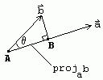
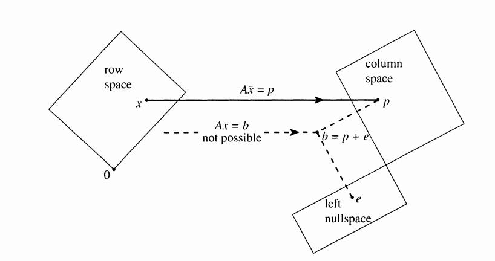

This is the summary of the topics covered by Gilbert Strang in his lectures

Table of Contents:

*   [Lectures 1-5](#L1-5)
*   [Lectures 6-10](#L6-10)
*   [Lectures 11-15](#L11-15)

## Lectures 1-5

Covers the basic matrix concepts

*   Matrix Row picture and Column picture
*   Can we solve for \\(Ax=b\\) for all \\(b\\) ?. No, only for \\(b\\)'s in the column space of \\(A\\).

#### Four ways of matrix multiplication

*   Dot product
*   Column picture
*   Row picture
*   Column times Row

#### Gaussian Elimination

*   Operates on the rows of matrix \\(A\\), finally puts the matrix in **_Row Reduced Echelon_**(**_REF_**) form
*   Gaussian elimination leads to \\(A = LU\\) form, and \\(A = LDU\\) form

#### Gauss-Jordon form

*   Helps to put the elements of \\(A\\), in the **_Row Reduced Echelon Form_** (**_RREF_**) form
*   Can be used to solve for \\(x\\) in \\(Ax = b\\), by finding **_RREF([\\(A\\) | \\(b\\)])_** which results in **_[\\(I\\) | \\(x\\)]_**
*   Can be used to find the inverse of the matrix \\(A\\) by finding **_RREF[\\(A\\) | \\(I\\)]_** which results in **_[\\(I\\)|\\(A^{-1}\\)]_**

#### Permutation matrix

*   Number of permutation matrix \\(A_{N*N} = N!\\)
*   \\(P^T = P\\) (where \\(P^T\\) is **_transpose_**(\\(P\\)))
*   \\(P P^T = I\\) (_Can you prove? Hint: use definition of matrix multiplication_) *   If the number of equations are less than number of variables, why we cannot solve the equation?  *   This is because rank of the matrix will be less than the number of variables we need to solve, so it will have infinite number of solutions *   Use **_RREF(\\(A\\))_** in matlab/octave and check
*   \\(A A^T\\) is symmetric, prove!

## Lectures 6-10

#### Vector Space

*   All linear combination of vectors are in the space, called **_Vector Space_**

*   Say \\(P\\) and \\(L\\) are two subspaces

    *   Is \\(P\cup L\\) a subspace? No, because some combination of vector \\(A \in P\\) and vector \\(B \in L\\) might not be in the subspace \\(P\cup L\\).

#### Column Space and Null Space

*   **_Column Space C(\\(A\\))_** is all possible linear combinations of column vectors in a matrix \\(A\\)

*   **_Null Space N(\\(A\\))_** is all the \\(x\\)'s for which \\(Ax = 0\\)

*   Elimination process will change **_Column Space_** of \\(A\\), but not the **_Null space_** of \\(A\\)

    *   This is because in the elimination process we change \\(A\\), but not \\(x\\).

#### Basic and Free Variables

*   The real difference between **_basic_** variables and **_free_** variables is that the **_free_** variables can be anything, and the **_basic_** variables are determined by solving the equations

*   **_Basic_** variables are also called as **_Pivot_** variables. The columns with these variables are called **_Pivot_** columns

*   Number of **_Pivot_** columns = **_Rank_** **r** of the matrix = Number of independent columns in the matrix

*   Number of **_Free_** columns = **n** - **r** ( **n** = number of columns in matrix \\(A\))

#### Solution for Ax = b

Rank tells you everything about the number of solutions

*   _Full column rank matrix_: Unique solution exists, if \\(b\\) lies in column space of \\(A\\)
*   _Full row rank matrix_: Infinite number of solutions
*   _Full row rank/ full column rank_: Unique solution always exists for all \\(b\\)
*   No full column rank/ No full row rank: Infinitely many solution exists if \\(b\\) lies in column space of \\(A\\)

#### Basis

*   Basis of a vector space is sequence of vectors \\(v\_1, v\_2, v\_3, ..., v\_N\\) with the following properties
    *   They are independent
    *   They span a space

#### Four Subspaces

For a matrix \\(A_{m*n}\\)

*   _Column space_ **_C(\\(A\\))_**: combination of columns of \\(A\\), lies in \\(R^n\\)
*   Null space **_N(\\(A^T\\))_** : left null space of \\(A\\), lies in \\(R^n\\)
*   _Row space_ **_R(\\(A\\))_**: combination of columns of \\(A^T\\), lies in \\(R^m\\)
*   _Null space_ **_N(\\(A\\))_**: right null space of \\(A\\), lies in \\(R^m\\)
*   Row operation on a matrix \\(A\\) changes the column space of \\(A\\), but preserves the row space of \\(A\\)

## Lectures 11-15

#### Vector Space of Matrices
* Consider vector space of matrices \\(A_{N*N}\\)
	- Dimension of vector space of symmetric matrices = \\(\(N^2 + N\)/2\\)
	- Dimension of vector space of skew symmetric matrices = \\(\(N^2 - N\)/2\\)
	- Dimension of vector space of upper triangular  matrices = \\(\(N^2 + N\)/2\\)
	- (Symmetric matrix \\(\cap\\) Upper triangular matrices) = Diagonal
	    matrices. Dimension of vector space = \\(\(N^2 - N\)/2\\)
	- (Symmetric matrix \\(\cup\\) Upper triangular matrices) = All \\(N*N\\) matrices. Dimension of vector space = \\(N^2\\)

#### Rank-1 Matrices
* They are special case
* They are building blocks for every other matrices
* Matrices with Rank-1 are separable matrices ( this is the
  application in image processing for separating the filters)

#### Orthogonality 
* Prove that two vectors \\(X\\) and \\(Y\\) are orthogonal to each other if
  \\(X^T Y = 0 = Y^T X\\)
* _Row space_ is perpendicular to _Right null space_ , i.e., every vector
  in row space is perpendicular to every other vector in right
  null space
* _Column space_ is perpendicular to _left null space_, i.e., every
  vector in column space  is perpendicular to every other vector
  in left null space

#### Projection Matrix

* Projection of vector \\(b\\) onto vector \\(a\\) is defined as \\(p = Pb\\), where \\(P = (a a^T)/(a^T a) \\)
    

    
    

* Column space of projection matrix \\(P\\) is column space of \\(a\\). i.e., line through \\(a\\)
* Properties of Projection matrices
	- \\(P^T = P\\) 
	- \\(P^2 = P\\)
* Projection matrix in general
	- We have \\(A^T A \hat{x} = A^T B\\)
	- \\(P = A \hat{x}\\), where \\(\hat{x} = (A^T A)^{-1} A^T B\\)
	    and \\(P = A (A^T A)^{-1} A^T \\)

#### Least square problem
* Why projection ? 
	- When we have only few unknowns, but many equations to solve
	    \\(Ax = b\\), \\(b\\) might not be the column space of
	    \\(A\\)
	- To solve for \\(x\\), we project \\(b\\) onto columns
	    space of \\(A\\), so that the new vector \\(\bar{b}\\) is closest
	    to \\(b\\)
  	- **_Eg_**. Measuring pulse of the heart, but repeatedly we take
	  measurements so that on an average we can estimate the pulse. 
	  For more detailed treatment of least squares,
  [link](http://home.engineering.iastate.edu/~julied/classes/CE570/Notes/strangpaper.pdf)
* The pictorial representation of solving least squares is shown below
	- Least squares: \\(\bar{x}\\) minimizes \\(b - Ax\\) by solving \\(A^T A \bar{x} = A^T b\\)
    

    
    

* \\(A^T A\\) is invertible, if \\(A\\) has independent columns, prove
  it

